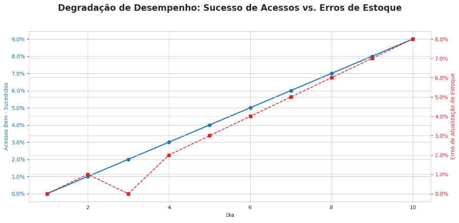
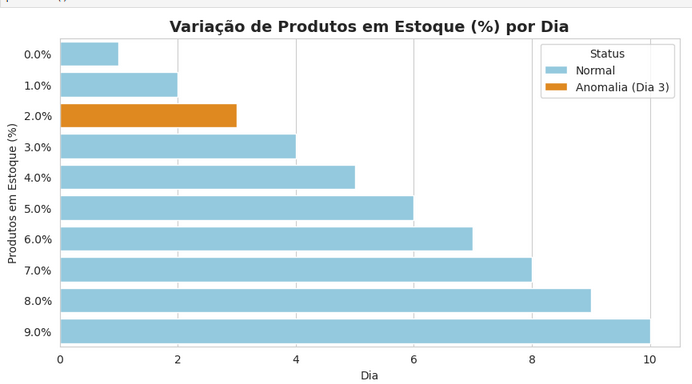

# Eng_dados-Analise_tendencias
Atividade proposta: Você é responsável pelo monitoramento de um sistema de gerenciamento de estoque em uma empresa de varejo. Nos últimos dias, o sistema começou a apresentar problemas de integridade nos dados. Para entender melhor o que está acontecendo, você e sua equipe decidem analisar os dados de funcionamento do sistema

# Análise de Desempenho do Sistema de Gerenciamento de Estoque

##  Visão Geral do Projeto

Este projeto consiste na análise de dados operacionais diários de um sistema de gerenciamento de estoque, com o objetivo de identificar **tendências de degradação de desempenho** e **problemas de confiabilidade** em módulos críticos.

A análise abrange 10 dias de operação e foca em métricas de acesso do usuário e erros nas operações de atualização de estoque.

### Objetivos Principais:
* Identificar padrões de falha e anomalias nos dados.
* Visualizar a correlação entre o sucesso dos acessos e a taxa de erros.
* Determinar a causa raiz da degradação de performance.

---

##  Análise e Conclusões Chave

A análise dos dados aponta para uma **degradação sistêmica** e uma forte correlação entre o aumento de erros no módulo de estoque e a queda na proporção de acessos bem-sucedidos.

### Conclusões Chave:

1.  **Confiabilidade em Queda Livre:** A proporção de acessos bem-sucedidos caiu de **96,7%** (Dia 1) para **89,5%** (Dia 0), indicando que o sistema está falhando em processar solicitações cada vez mais frequentemente.
2.  **Causa Raiz: Módulo de Estoque:** No mesmo período, a **Proporção de Operações com Erros** no módulo de atualização de estoque disparou de **1% para 9%**. Este módulo é o principal vetor de instabilidade, provavelmente devido a **gargalos de concorrência ou *timeouts***.
3.  **Anomalia de Contagem:** Foi identificada uma queda atípica nos **Produtos em Estoque (%)** no **Dia 3** (de 63,0% para 52,8%), que requer auditoria de logs para verificar se foi um erro de contagem ou um evento operacional não registrado.

---

##  Visualizações Gráficas

As visualizações a seguir demonstram graficamente as tendências de degradação identificadas.

### Gráfico de Tendência: Sucesso vs. Erros (Eixos Duplos)

Este gráfico de combinação é crucial para demonstrar a relação inversa entre as métricas.

***Destaque Visual:** As linhas formam uma "tesoura", onde a linha azul (Sucesso) cai enquanto a linha vermelha (Erros) sobe, confirmando a correlação.

### Anomalia em Produtos em Estoque

Este gráfico de colunas destaca o ponto de dados que foge do padrão.

***Destaque Visual:** A coluna referente ao **Dia 3** é visivelmente mais baixa, evidenciando a anomalia.

---

##  Recomendações

Com base na análise, as seguintes ações são sugeridas:

1.  **Prioridade Imediata:** Focar na otimização do módulo de **Atualização de Estoque**. Deve-se investigar o aumento dos erros (9%) para estabilizar o sistema.
2.  **Investigação de Logs:** Realizar uma investigação detalhada dos logs do **Dia 3** para entender a queda abrupta no percentual de estoque.
3.  **Monitoramento:** Implementar monitoramento de desempenho de infraestrutura (CPU e Memória) para identificar o ponto de saturação que está causando a queda geral de performance.

---

##  Metodologia e Ferramentas

* **Linguagem de Programação:** Python
* **Manipulação de Dados:** Pandas
* **Visualização de Dados:** Matplotlib e Seaborn
* **Ambiente:** Jupyter Notebook

**\[Marcus Vinicius da Silva Souza]**
